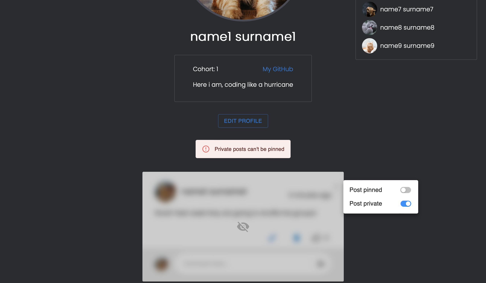

# Cohort Manager

This app is deployed at [https://cohortmanager.netlify.app](https://cohortmanager.netlify.app)

A web-based learning management system where teachers and admins can manage courses and users while allowing interactions among students and teachers by implementing a post area.

## Table of contents

- [Cohort Manager](#cohort-manager)
  - [Table of contents](#table-of-contents)
  - [General info](#general-info)
  - [Login and password](#login-and-password)
    - [Admin](#admin)
    - [Teacher](#teacher)
    - [User](#user)
  - [Technologies](#technologies)
  - [Run this project locally](#run-this-project-locally)
  - [Main features implemented by our team](#main-features-implemented-by-our-team)

## General info

This is the client repository for Cohort Manager. You can find the server repository [here](https://github.com/ning905/team-dev-server-c6).

This project is built for the Boolean Course as the team development project.

## Login and password

Your can login using the following emails and passwords

### Admin

Email: admin@admin.com
Password: 123

### Teacher

Email: teacher@teacher.com
Password: 123

### User

Email: test0@test.com
Password: 123

Alternatively, you can sign up a new account

## Technologies

Project is created with:

HTML, CSS, JavaScript, React, Scss, Material UI, Axios

## Run this project locally

1. Fork this repository and clone the fork to your machine.
2. `npm install`
3. `npm start`
4. Fork the [server repository](https://github.com/ning905/team-dev-server-c6) and follow the instructions.

## Main features implemented by our team

1. When a user is logged in, they will see a list of recent posts, with the most popular post of the week to be highlighted. They can also interact with the posts by liking or commenting on them.
   

2. A user's profile shows a list of that user's post history. The user can choose to pin a post or make a post private.
   
   
   

3. A user can choose to deactivate their account and reactivate their account by simply logging in to the app again.
   
   

4. Admins and teachers can still see the posts made by a deactivated user and view their profile, while they are displayed as `[removed]` to users.
   
   
